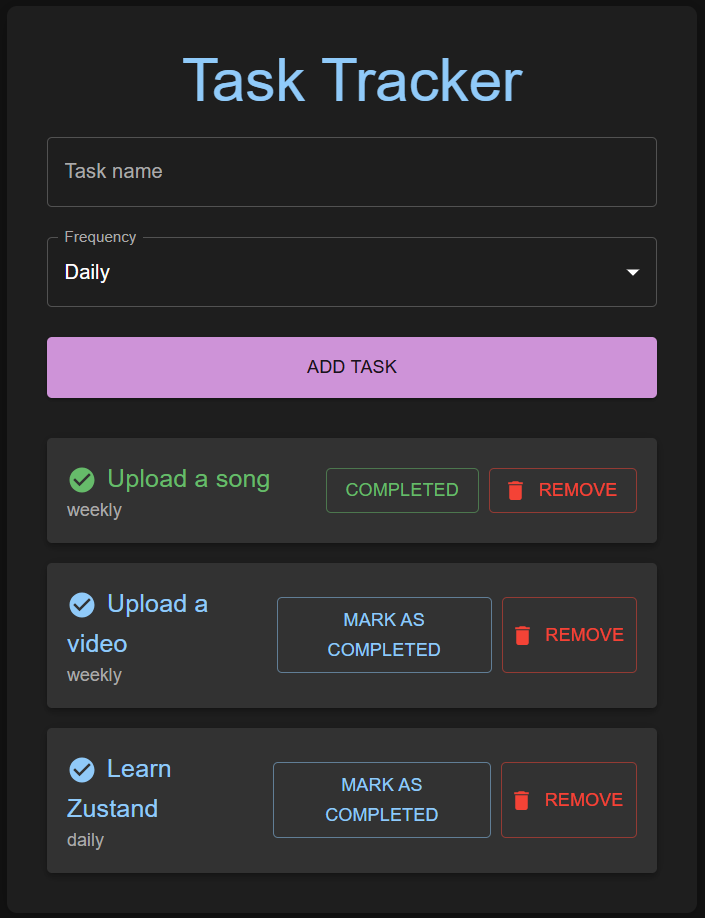

# Task Tracker

A simple task tracker application built with React, Zustand, and Material UI. Easily add, view, and manage your daily and weekly tasks.

## Features

- **Add tasks:** Enter a task name and select its frequency (daily or weekly).
- **View tasks:** See all your active tasks in a responsive list.
- **Mark as completed:** (Feature in progress) Mark tasks as completed on the current day.
- **Remove tasks:** (Feature in progress) Remove tasks from your list.
- **Responsive design:** Task list and forms adapt to different screen sizes.

## How to Run the App

1. **Clone or download** the repository.
2. **Install dependencies** by running:
```bash
npm install
```
3. **Start the development server**:
```bash
npm run dev
```
4. **Open your browser** and go to:
http://localhost:3000

## Usage

- **Add a task:** Fill in the form at the top of the page and click "Add Task".
- **View tasks:** All tasks are displayed in a list below the form.
- **Mark as completed:** (Coming soon) Click the "Mark as Completed" button.
- **Remove a task:** (Coming soon) Click the "Remove" button.

## Dependencies

- React
- Zustand (state management)
- Material UI (UI components)
- TypeScript

## Screenshots



---
